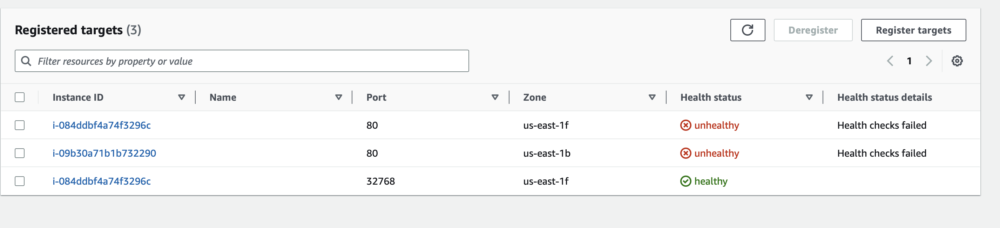
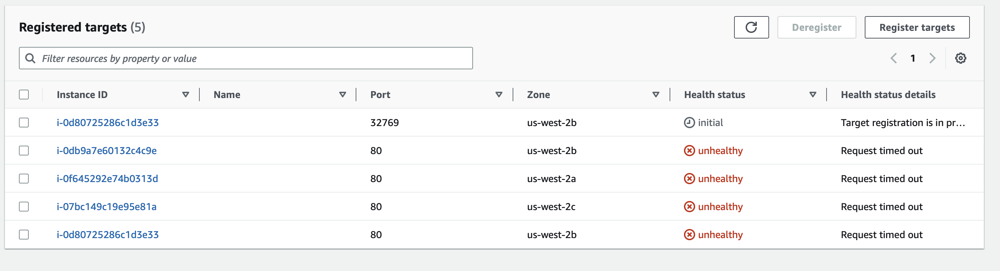

# install

1. Run `make init`
2. Create file `var-demo.tfvars`:
    ```commandline
    aws_access_key = "..."
    aws_secret_key = "..."
    ```
3. Run `make apply`


# trouble

1. Same Terraform project work in old AWS-account and not work in new.

| First AWS Account (old)      |         Second AWS Account (new) |
|------------------------------|---------------------------------:|
|  |  |


2. Targets with 80 ports are misleading.